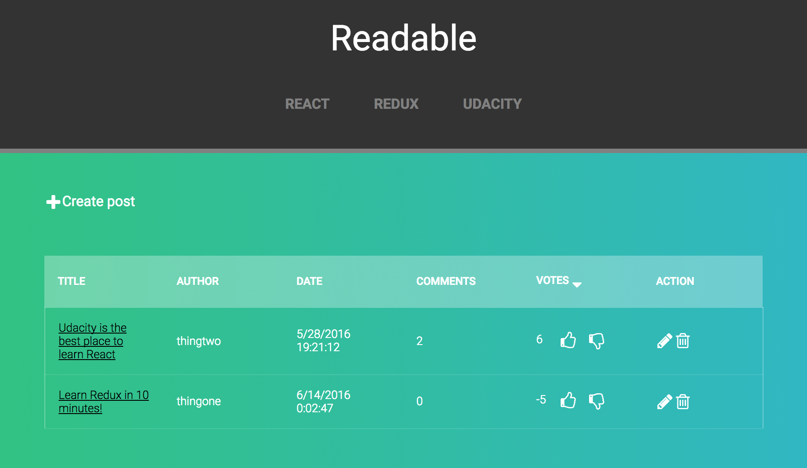
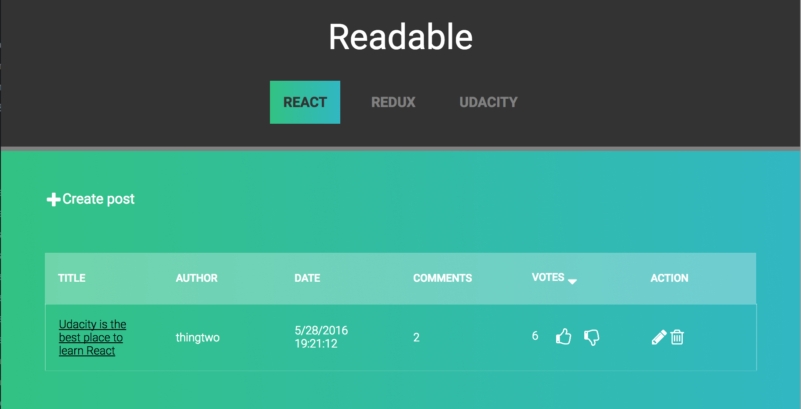
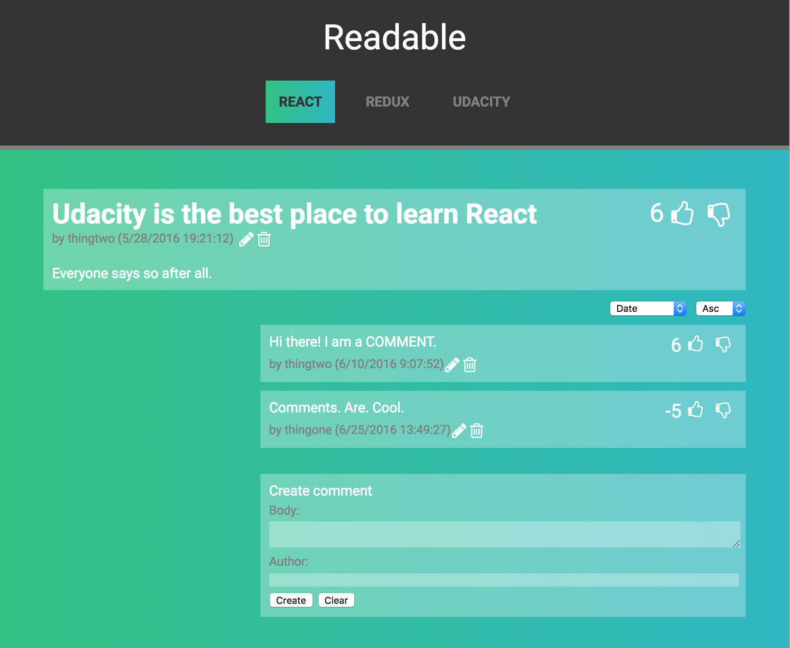

# Readable Project

Users will be able to post content to predefined categories, comment on their posts and other users' posts, and vote on posts and comments. Users will also be able to edit and delete posts and comments.

## Root page

## Category page

## Post page

## Foundation

This project is based on the [starter template](https://github.com/udacity/reactnd-project-readable-starter) for the final assessment project for Udacity's React Fundamentals course.

## Try out

To try out the final project:

* Install and start the API server
    - `cd api-server`
    - `npm install`
    - `node server`
* In another terminal window, use Create React App to scaffold out the front-end
    - `create-react-app frontend`
    - `cd frontend`
    - `npm start`

## API Server

Information about the API server and how to use it can be found in its [README file](api-server/README.md).
